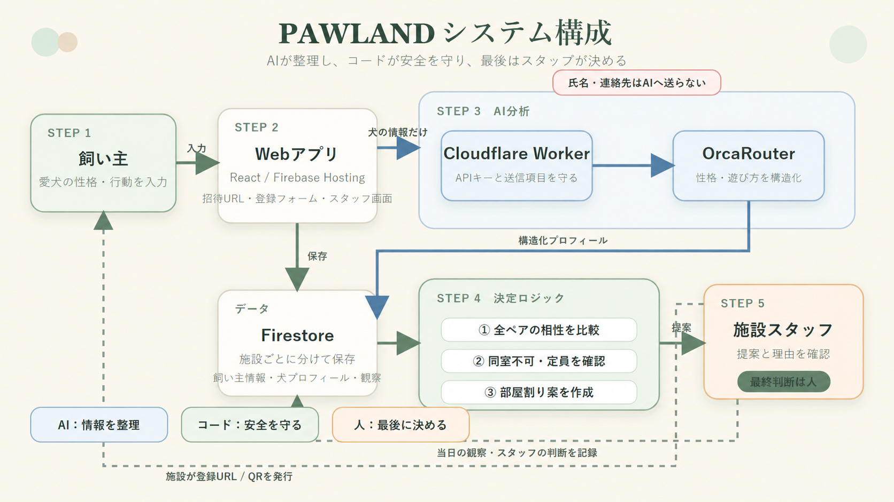

# PAWLAND アーキテクチャ

## 目標の実フロー

~~~mermaid
flowchart LR
    Owner[飼い主フォーム]
    App[Reactアプリ]
    Firestore[(Firebase Spark Firestore)]
    Worker[Cloudflare Workers Free]
    Orca[OrcaRouter]
    Frame[ブラウザ内メディア処理 写真 + 動画由来JPEG最大2枚]
    Profile[性格パラメータと 分析結果]
    Pair[全ペア採点 n(n-1)/2]
    Optimize[部屋割り最適化]
    Operator[単一オペレーター 確定]

    Owner --> App
    App -->|性格・遊び方・注意事項だけ| Worker
    App -->|写真/動画を一時処理| Frame
    Frame -->|画像のみ。元動画・音声なし| Worker
    Worker -->|実解析要求| Orca
    Orca -->|構造化応答| Worker
    Worker --> App
    App -->|受付・分析結果保存/read-back| Firestore
    Firestore --> Profile
    Profile --> Pair
    Pair -->|全ペア完了後| Optimize
    Optimize --> Operator
    Optimize -->|提案保存| Firestore
    Frame -.解析後破棄.-> Frame
~~~

AIがエラーを返した場合、Worker/アプリはエラーを表示し、固定結果・ローカル判定・疑似成功へ切り替えない。動画はブラウザで静止画へ変換し、元動画と動画内音声をOrcaRouterへ送らない。オペレーターが提案を確認してから確定する。

## 現時点の実装境界

~~~mermaid
flowchart TB
    Form[OwnerForm 入力・ローカルプレビュー]
    App[App送信処理 AI解析→Firestore保存→照合]
    Firebase[(Firebase Spark Hosting/Rules配備・read-back確認済み)]
    WorkerClient[WorkerClient Appから呼出し]
    Frame[写真 + 動画由来JPEG 元動画・音声は送信しない]
    Worker[pet-hotel-agent-api Workers Free配備済み]
    Orca[OrcaRouter 実構造化応答確認済み]
    Matcher[全ペア採点・最適化コード]

    Form --> App
    App --> WorkerClient
    App --> Frame
    Frame --> WorkerClient
    WorkerClient --> Worker
    Worker --> Orca
    Orca --> Worker
    Worker --> App
    App -->|受付・プロフィール・提案・観測| Firebase
    Firebase -->|read-back| Matcher
    Matcher -->|再計算・確定保存| Firebase
~~~

Cloudflare Workerの配備、health、Secret参照、media storage無効、OrcaRouter実構造化応答は確認済みである。Workerはprofile 3項目と画像だけを許可し、旧`prompt`は400、raw動画・音声は415、永続media APIは410で拒否する。動画はブラウザで最大2枚のJPEGフレームへ変換するため、元動画と音声はWorkerへ渡らない。

Firebase Project / Web App / Spark / `asia-northeast1`、Hosting / Rules配備、Firestore read-backを確認済みである。公開URLは `https://pawpair-ai-hack-2026.web.app`。Firebaseを有効にした実フローではOwnerIntakeをlocalStorageへミラーせず、公開E2Eでも該当keyがnullだった。

2026-09-22に架空2頭を登録し、Worker / OrcaRouter実分析、Firestore受付保存、非PIIプロフィール保存/read-back、全1ペア採点、1部屋最適化、当日観測保存・再計算、施設オペレーター最終確定まで成功した。console error/warnは0件、390 × 844のモバイル表示も成功した。

## 構成・料金境界

| 部品 | 境界 |
|---|---|
| Firebase | Sparkのみ。FirestoreとHosting。Cloud Functions/Cloud Storage for Firebaseなし |
| AIプロキシ | Cloudflare Workers Freeのみ |
| OrcaRouter Secret | 再発行済みキーをWorker Secretへだけ格納。以前チャットに貼ったキーは禁止 |
| メディア | 写真と動画由来JPEGフレームだけを一時入力。元動画・音声・永続R2保存なし |
| 利用者 | 単一利用者、固定URL |

Firebase Project ID `pawpair-ai-hack-2026`、Firestore `asia-northeast1`、Spark、Hosting URL、Rules配備を確認済みである。公開Rulesは認証を省いたハッカソン限定構成で、匿名書込みによる無料枠消費リスクがある。詳細は [TASKS.md](../TASKS.md) と [実装設計書](実装設計書_Firebase版.md) を参照。
